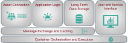

# AIT Rapid Deployment Platform

## Overview

## RDP Components

| | |
|------|--------------------------|
|  | [RDP Database](https://ait-rdp.github.io/rdp-database): Hosts the scheme as well as the migration scripts that set up the long-term storage based on Timescale DB |
|  | [RedSQL Data Sync](https://ait-rdp.github.io/rdp-redsql): Generic Redis to SQL data synchronizer |
|  | [PyRDP Commons](https://ait-rdp.github.io/pyrdp-commons): A small helper library to group common AIT RDP functions and to provide a unified user experience |
|  | [RDP Data Crawler](https://ait-rdp.github.io/rdp-data-crawler): Periodically fetches publicly available forecast and measurement information and stores it into Redis streams |
|  | [Modbus Crawler](https://ait-rdp.github.io/rdp-modbus-crawler): Simple Python Modbus Crawler that reads registers of a Modbus server/slave based on a register secification in a data frame/csv/... |
